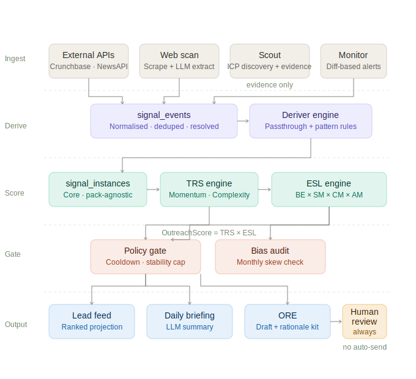

# SignalForge

> AI lead intelligence platform for fractional technical leaders.  
> Monitors startup companies, scores technical inflection points, and surfaces 
> outreach opportunities — with ethical guardrails baked into the architecture.

**Stack:** Python · FastAPI · PostgreSQL · SQLAlchemy 2.x · Alembic · 
multi-provider LLM abstraction · Jinja2

---

## What it does

SignalForge watches a portfolio of startup companies across multiple signal 
sources (funding events, hiring patterns, product launches, website changes) 
and answers two questions:

1. **Is this company entering a technical inflection point?** (TRS — Technical 
   Readiness Score)
2. **Is this a healthy moment to reach out?** (ESL — Engagement Suitability 
   Layer)

When both conditions are met, it generates a human-reviewed outreach kit — a 
draft message, rationale, and safeguard checklist. It never sends automatically.

---

## Architecture



The pipeline runs in five stages:

| Stage | What happens |
|-------|-------------|
| **Ingest** | Pull events from external APIs; scrape company websites; run Scout discovery |
| **Derive** | Core deriver engine converts raw events → typed `signal_instances` (pack-agnostic) |
| **Score** | TRS engine scores technical readiness; ESL engine modulates outreach timing |
| **Gate** | Policy gate enforces cooldowns, stability caps, and weekly limits |
| **Output** | Lead feed · daily briefing · ORE outreach recommendation kit |

### Key engineering decisions

**LLM provider abstraction.** All LLM calls go through a provider interface 
(`app/llm/`) rather than calling Anthropic or OpenAI directly. Swapping 
providers requires changing one environment variable.

**Core vs. pack separation.** Signal derivation (taxonomy + rules) is 
pack-agnostic and deterministic. Scoring weights, ESL rubric, and outreach 
playbooks live in swappable pack configs. Changing a pack reloads analysis 
config only — no re-ingestion, no re-derivation.

**ESL as a braking system.** The Engagement Suitability Layer is designed to 
*reduce* outreach intensity when a founder shows stress signals, not increase it. 
`OutreachScore = TRS × ESL`. High pressure → lower ESL → lower score → no 
outreach. This is architectural, not configurable.

**Migration-driven schema management.** All schema changes go through Alembic 
migrations. No ad-hoc DDL.

---

## Ethical guardrails

SignalForge was built with explicit constraints:

- **No automatic outreach.** The ORE produces drafts and rationale. A human 
  always reviews before anything is sent.
- **Cooldown enforcement.** Companies can't be targeted more than once per 
  configured period, enforced at the policy gate layer.
- **Stability caps.** If a founder's StabilityModifier drops below 0.7, 
  outreach is capped at "Soft Value Share" regardless of TRS score.
- **Monthly bias audit.** An automated job checks for demographic skew in 
  outreach recommendations.
- **No neurodivergence inference.** The system does not attempt to classify 
  psychological traits or exploit distress signals.

---

## Tech stack

| Layer | Technologies |
|-------|-------------|
| API | FastAPI · Jinja2 templates · token-authenticated internal endpoints |
| ORM / DB | SQLAlchemy 2.x · Alembic · PostgreSQL |
| LLM | Multi-provider abstraction (Anthropic by default) · versioned prompt files |
| Ingestion | Modular adapters (Crunchbase, NewsAPI, Product Hunt, GitHub, + custom) |
| Scoring | Deterministic TRS engine · ESL formula (BE × SM × CM × AM) |
| Deployment | Cloudways · cron-driven pipeline jobs |

---

## Project structure
```
app/
├── api/              # Route handlers (companies, briefing, outreach, scout)
├── core_taxonomy/    # Canonical signal IDs and dimensions (YAML, validated at startup)
├── core_derivers/    # Passthrough + pattern deriver rules
├── ingestion/        # Adapters + normalization
├── llm/              # Provider abstraction layer
├── models/           # SQLAlchemy ORM models
├── prompts/          # Versioned LLM prompts
├── schemas/          # Pydantic request/response schemas
├── services/         # Business logic (scoring, ESL, ORE, briefing, scout)
└── templates/        # Jinja2 UI templates
packs/                # Scoring weights, ESL rubric, outreach playbooks
alembic/              # Database migrations
docs/                 # Architecture, pipeline, glossary, ADRs
```

---

## Local setup
```bash
./scripts/setup.sh --dev --start
```

This validates Python 3.11+, creates the virtualenv, applies migrations, 
and starts the dev server. See the full [setup guide](docs/USER_ONBOARDING.md) 
for manual steps and environment variables.

**Required env vars:** `DATABASE_URL` · `SECRET_KEY` · `INTERNAL_JOB_TOKEN` · 
`LLM_API_KEY`

---

## Internal pipeline endpoints

Cron-driven jobs call these authenticated endpoints:
```
POST /internal/run_daily_aggregation   # ingest → derive → score (recommended)
POST /internal/run_scan                # website scrape + LLM analysis
POST /internal/run_briefing            # generate daily briefing
POST /internal/run_scout               # ICP-based company discovery
POST /internal/run_bias_audit          # monthly skew check
```

All require `X-Internal-Token` header.

---

## Documentation

### User-facing

| Doc | Description |
| --- | --- |
| [docs/USER_ONBOARDING.md](docs/USER_ONBOARDING.md) | Quick start: login, add/import companies, briefing, record outreach |
| [docs/USER_GUIDE.md](docs/USER_GUIDE.md) | Full user guide: onboarding, concepts, task-based tutorials |

### Technical

| Doc | Description |
|-----|-------------|
| [docs/pipeline.md](docs/pipeline.md) | Pipeline stages, idempotency, pack scoping |
| [docs/DEVELOPER_ONBOARDING.md](docs/DEVELOPER_ONBOARDING.md) | Full architecture, feature map, dev workflow |
| [docs/GLOSSARY.md](docs/GLOSSARY.md) | TRS, ESL, ORE, ADR, and all acronyms |
| [docs/deriver-engine.md](docs/deriver-engine.md) | Deriver types, evidence, logging |
| [docs/Outreach-Recommendation-Engine-ORE-design-spec.md](docs/Outreach-Recommendation-Engine-ORE-design-spec.md) | ORE policy gate, strategy selector, draft generator |

---

## Status

MVP complete. Active development.

Built by [Tricia Ballad](https://linkedin.com/in/triciaballad) · 
[HexCodeStudio](https://hexcodestudio.com)
